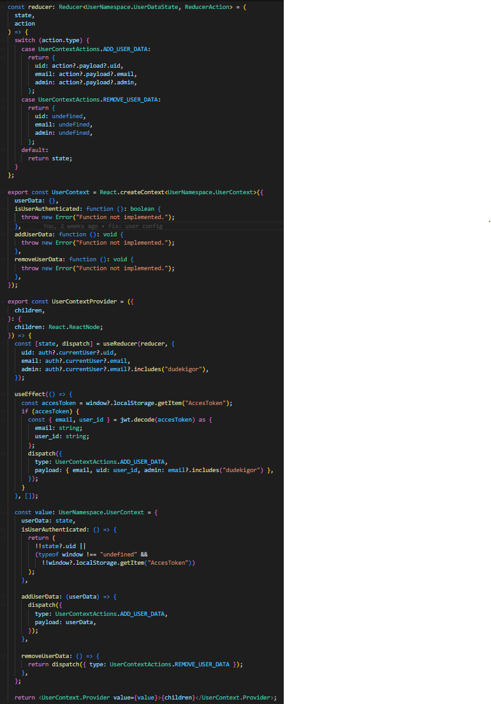
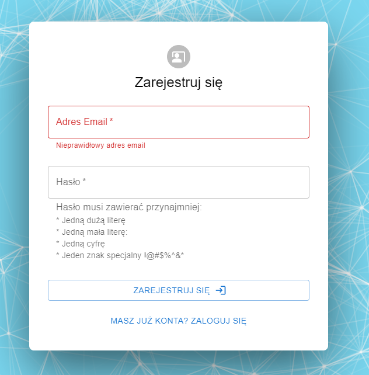
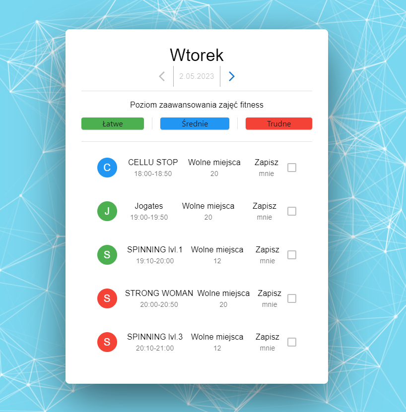
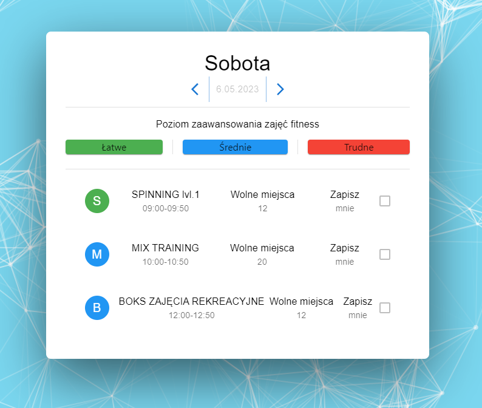
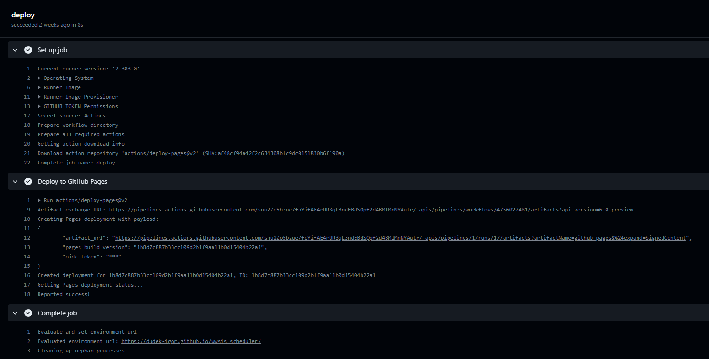

# Ftiness Scheduler

- [Ftiness Scheduler](#ftiness-scheduler)
  - [Informacje wstępne](#informacje-wstępne)
    - [Strona Internetowa - https://dudek-igor.github.io/wwsis_scheduler/](#strona-internetowa---httpsdudek-igorgithubiowwsis_scheduler)
    - [Zajęcia - Projekt Zespołowy](#zajęcia---projekt-zespołowy)
    - [Prowadzący - Maciej Muras](#prowadzący---maciej-muras)
    - [Wrocławska Wyższa Szkoła Informatyki Stosowanej HORYZONT](#wrocławska-wyższa-szkoła-informatyki-stosowanej-horyzont)
  - [Opis](#opis)
  - [Start](#start)
  - [Komendy/Scripts](#komendyscripts)
  - [Użyte technologie](#użyte-technologie)
    - [React](#react)
    - [Next.js](#nextjs)
    - [Typescript](#typescript)
    - [Firebase](#firebase)
  - [Rozwiązania Technologiczne](#rozwiązania-technologiczne)
    - [Stylowanie Aplikacji](#stylowanie-aplikacji)
    - [Authentication from Firebase](#authentication-from-firebase)
    - [Firestore from Firebase Firebase](#firestore-from-firebase-firebase)
    - [Zarządzanie stanem aplikacji](#zarządzanie-stanem-aplikacji)
    - [Github Pages](#github-pages)
  - [Użycie Aplikacji](#użycie-aplikacji)
    - [Strona Startowa](#strona-startowa)
      - [Bez uprzedniego zalogowania](#bez-uprzedniego-zalogowania)
      - [Uprzednio zalogowany użytkonik](#uprzednio-zalogowany-użytkonik)
    - [Logowanie](#logowanie)
    - [Walidacja dahnych podczas logowania](#walidacja-dahnych-podczas-logowania)
    - [Rejestracja](#rejestracja)
    - [Walidacja danych podczas rejestracji](#walidacja-danych-podczas-rejestracji)
    - [Planer](#planer)
    - [Strona 404](#strona-404)
    - [Github Workflow](#github-workflow)
    - [Propzycje dalszego rozwóju](#propzycje-dalszego-rozwóju)

---

## Informacje wstępne

### Strona Internetowa - https://dudek-igor.github.io/wwsis_scheduler/

### Zajęcia - Projekt Zespołowy

### Prowadzący - Maciej Muras

### Wrocławska Wyższa Szkoła Informatyki Stosowanej HORYZONT

---

## Opis

Projekt zespołowy wykonywany w zespole jednoosobowym. \
Podstawowy harmonogram zajęć fitness przeznaczony dla siłowni.

---

## Start

```bash
$ git clone <repo>
$ cd <project>
$ npm install
```

---

## Komendy/Scripts

```bash
$ npm run dev # Uruchomienie serweru lokalnie do developmentu aplikacji
$ npm run lint # Sprawdzanie jakości kodu (quality) w paczkach poprzez reguły eslint
$ npm run build # Zbudowanie dynaminczej aplikacji do katalogu "./build" (z serwerem)
$ npm run export # Zbudowanie statycznej aplikacji do katalogu "./out" (bez serwerem)
$ npm run start # Urchomienie uwcześnie zbudowanej aplikacji (z katalogu "./build")
```

---

## Użyte technologie

1. Główne Technologie:
   - [React](react)
   - [Next.js](nextjs)
   - [Typescript](typescript)
   - [Styled Components](styled-components)
   - [Tailwind](tailwind)
   - [Firebase](firebase)
2. Narzędzia Developerskie:
   - [Eslint](eslint)
   - [Prettier](prettier)
   - [Husky](husky)
   - [Lint-Staged](lint-staged)
   - [Commitizen](commitizen)

### React

React to biblioteka języka JavaScript, stworzona przez firmę Facebook, która umożliwia tworzenie dynamicznych interfejsów użytkownika w aplikacjach webowych. React skupia się na wydajnym i szybkim renderowaniu widoków poprzez wykorzystanie tzw. Virtual DOM (wirtualnego drzewa wirtualnych elementów interfejsu).

### Next.js

Next.js to popularny framework do tworzenia stron internetowych w języku JavaScript. Framework ten oparty jest na platformie Node.js i został zaprojektowany do tworzenia aplikacji webowych wykorzystujących najnowsze technologie. \
Główną zaletą Next.js, są sposób renderowania treści:

1. Renderowanie po stronie serwera (SSR) - pozwala na wygenerowanie strony na serwerze przed przesłaniem jej do przeglądarki użytkownika. Ta metoda jest wykorzystywana, aby umożliwić wyszukiwarkom przeglądanie strony oraz zwiększyć szybkość wczytywania strony poprzez wczytywanie elementów strony po stronie serwera.
2. Renderowanie po stronie klienta (CSR) - pozwala na szybsze ładowanie stron i jest stosowane do renderowania dynamicznych interakcji po stronie użytkownika. W przypadku CSR, cała strona jest generowana po stronie przeglądarki użytkownika z użyciem JavaScript.
3. Aktulizowanie stron po zbudowaniu witryny - Incremental Static Regeneration (ISR) - umożliwia generowanie statyczne dla poszczególnych stron bez konieczności przebudowywania całej witryny. Dzięki ISR ​​możesz zachować zalety statycznego renderowania przy skalowaniu dla wielu podstron.
4. Renderowanie statyczne - pozwala na wygenerowanie statycznej wersji strony i przechowywanie jej na serwerze. Metoda ta pozwala na szybkie wczytanie strony bez potrzeby generowania jej na bieżąco.
5. Renderowanie hybrydowe - łączy w sobie cechy renderowania po stronie serwera i po stronie klienta, pozwalając na wykorzystanie obu metod w zależności od potrzeb.

### Typescript

TypeScript to język programowania, który jest rozszerzeniem języka JavaScript. TypeScript dodaje statyczne typowanie do JavaScript, co oznacza, że ​​programiści muszą deklarować typy zmiennych, argumentów funkcji i innych elementów kodu. TypeScript kompiluje się do JavaScript, co pozwala na uruchomienie kodu TypeScript na dowolnej platformie, na której działa JavaScript. Dzięki typowaniu TypeScript pozwala na większą pewność i wygodę w pracy programisty oraz poprawia jakość kodu, ułatwiając jego utrzymanie i rozwój.

### Firebase

Firebase to platforma dla aplikacji mobilnych i webowych, dostarczana przez Google. Firebase udostępnia zestaw narzędzi do budowania, testowania, wdrażania i zarządzania aplikacjami, a także do analityki i marketingu. \
Firebase oferuje szereg funkcji i usług, które mogą być wykorzystane do budowania aplikacji, takich jak autoryzacja użytkowników, baza danych w czasie rzeczywistym, powiadomienia push, hostowanie aplikacji, analiza użytkowników i wiele innych. \
Jednym z najważniejszych elementów Firebase jest Firebase Realtime Database, który umożliwia aplikacjom synchronizację danych w czasie rzeczywistym na różnych urządzeniach i platformach. Firebase oferuje również Firestore, bardziej zaawansowaną usługę bazodanową, która zapewnia wydajność, skalowalność i elastyczność. \
Firebase oferuje również narzędzia do tworzenia testów automatycznych, wdrażania kodu oraz wydajności aplikacji, takie jak Performance Monitoring i Crashlytics. \
Firebase jest bardzo popularny wśród deweloperów i startupów, ponieważ oferuje prosty interfejs, wysoką wydajność i skalowalność, a także liczne integracje z innymi narzędziami Google, takimi jak Google Analytics czy Google Cloud Platform.

---

## Rozwiązania Technologiczne

### Stylowanie Aplikacji

- Tailwind - Jest to biblioteka CSS, która umożliwia szybkie tworzenie interfejsów użytkownika. Zamiast definiować własne style CSS, Tailwind umożliwia korzystanie z gotowych klas, które odpowiadają określonym stylom. Tailwind zawiera dużą liczbę klas, które pozwalają na modyfikowanie wielu aspektów stylów, takich jak marginesy, wypełnienia, kolory itp.
- React Matrial UI - Jest to biblioteka komponentów interfejsu użytkownika dla frameworka React. Oferuje zestaw gotowych komponentów, takich jak przyciski, pola tekstowe, ikony itp., które można wykorzystać w projektach React. Komponenty Material UI są zgodne z wytycznymi Material Design opracowanymi przez Google.
- Atomic Design - Metodologia Atomic Design jest podejściem do projektowania interfejsu użytkownika, opierającym się na modularnym i skalowalnym budowaniu elementów strony.
  - Atom: najmniejsza, niezależna cząstka interfejsu użytkownika (np. przycisk)
  - Molekuła: połączenie kilku atomów tworzących bardziej skomplikowane elementy interfejsu (np. formularz)
  - Organizm: złożona konstrukcja złożona z molekuł i atomów, definiująca sekcję strony (np. nagłówek)
  - Template: gotowa strona składająca się z wielu organizmów

### Authentication from Firebase

Firebase Auth to usługa autoryzacji Firebase, która pozwala na szybkie i bezpieczne uwierzytelnienie użytkowników za pomocą e-maila i hasła, kont Google, Facebooka, Twittera i innych usług dostawców. Firebase Auth umożliwia również tworzenie niestandardowych systemów logowania, takich jak uwierzytelnienie z użyciem tokenów dostępu. \
Apliakcja automatycznie wyloguje użytkownika gdy token dostępu wygaśnie.

### Firestore from Firebase Firebase

Jest usługa bazodanowa Firebase, która umożliwia przechowywanie i synchronizowanie danych. Firestore oferuje różne poziomy uprawnień dostępu do danych, w tym dostęp tylko do odczytu, dostęp do odczytu i zapisu, a także dostęp do zarządzania. Firebase Auth i Firestore mogą współpracować, aby umożliwić kontrolowanie dostępu do danych w aplikacji w oparciu o tożsamość i uprawnienia użytkowników.

### Zarządzanie stanem aplikacji

Do zarządzania stanem aplikacji zostały wykorzystane hook-i jakie React oferuje - `useReducer` oraz `useContext`. \


### Github Pages

GitHub Pages to usługa umożliwiająca publikację statycznych stron internetowych bezpośrednio z repozytorium na platformie GitHub. Użytkownicy mogą hostować swoje strony internetowe bezpłatnie przy użyciu adresu URL opartego na nazwie użytkownika lub nazwie repozytorium. Strony te mogą być tworzone przy użyciu różnych języków programowania, takich jak HTML, CSS, JavaScript, a także popularnych frameworków, takich jak React czy Jekyll. GitHub Pages jest często wykorzystywany przez programistów i projektantów do hostowania swoich portfolio, dokumentacji projektów lub stron związanych z projektem open-source.

---

## Użycie Aplikacji

### Strona Startowa

#### Bez uprzedniego zalogowania


#### Uprzednio zalogowany użytkonik


### Logowanie


### Walidacja dahnych podczas logowania


### Rejestracja


### Walidacja danych podczas rejestracji




### Planer




### Strona 404


### Github Workflow



---

### Propzycje dalszego rozwóju

- miejscowa poprawa CSS,
- utworznie strony administracyjne do zarządzania,
- przejście na baze danych czasu rzeczywistgo, dla lepszej synchronizacji danych,
- utworznie apliakcji mobilnej w React Native oraz setup powiadomień push przez firebase

---

[react]: https://pl.react.dev/
[nextjs]: https://nextjs.org/
[typescript]: https://www.typescriptlang.org/
[styled-components]: https://styled-components.com/
[tailwind]: https://tailwindcss.com/
[firebase]: https://firebase.google.com/
[storybook]: https://storybook.js.org/
[eslint]: https://eslint.org/
[prettier]: https://prettier.io/
[husky]: https://typicode.github.io/husky/#/
[lint-staged]: https://github.com/okonet/lint-staged
[commitizen]: https://github.com/commitizen/cz-cli
